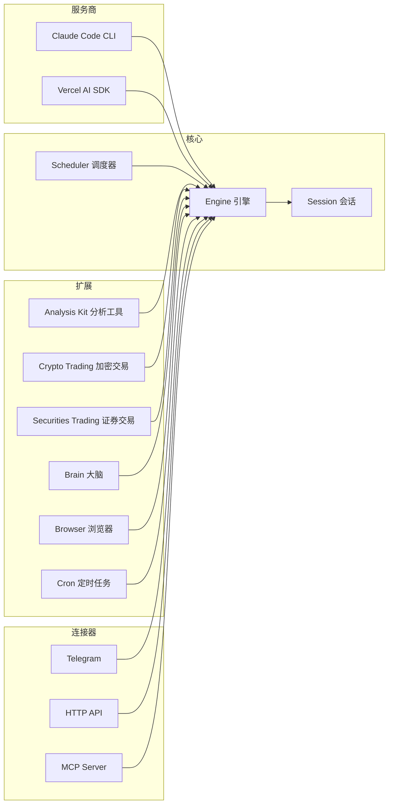

<p align="center">
  
</p>

# Open Alice

一个个人 AI 交易代理。她自动抓取新闻、计算量化因子、记录交易逻辑、在不同时间框架上构建策略，并 24/7 监控和调整你的投资组合。

- **文件驱动** — Markdown 定义人格和任务，JSON 定义配置，JSONL 存储对话。人类和 AI 都通过读写文件来控制 Alice。没有数据库、没有容器，只有文件。
- **推理驱动** — 每一个交易决策都基于持续推理和信号混合。访问 [github.com/imsatoshi/TradeClaw/live](https://github.com/imsatoshi/TradeClaw/live) 查看 Alice 的实时推理过程。
- **系统原生** — Alice 可以与你的操作系统交互。通过浏览器搜索网页、通过 Telegram 发送消息、连接本地设备。

## 功能

- **双 AI 引擎** — 运行时通过 Telegram `/settings` 切换 Claude Code CLI 和 Vercel AI SDK
- **灵活的模型后端** — Vercel AI SDK 支持任何 OpenAI 兼容的服务商（Anthropic、OpenAI、DeepSeek、Google 等）
- **加密货币交易** — CCXT（Bybit、OKX、Binance 等）或 [Freqtrade](https://www.freqtrade.io/) 策略机器人，动态白名单同步
- **证券交易** — Alpaca 美股集成，git 风格的钱包（stage、commit、push）
- **市场分析** — 技术指标（RSI、MACD、布林带等）、新闻搜索、价格模拟
- **认知状态** — 持久化的"大脑"，包含前额叶记忆、情绪追踪和提交历史
- **调度系统** — 心跳循环 + 定时任务，自动压缩上下文、去重和消息投递队列
- **连接器** — Telegram 机器人、HTTP Webhook、MCP Server

## 架构



**服务商** — 可互换的 AI 后端。Claude Code 以子进程方式启动 `claude -p`；Vercel AI SDK 在进程内运行 `ToolLoopAgent`，支持任何 OpenAI 兼容模型。

**核心** — `Engine` 管理 AI 对话，支持会话持久化（JSONL）和自动压缩。`Scheduler` 驱动自主心跳/定时循环。

**扩展** — 按领域划分的工具集，注入到引擎中。每个扩展拥有自己的工具、状态和持久化逻辑。

**连接器** — 外部接口。Telegram 机器人用于聊天，HTTP 用于 Webhook，MCP Server 用于工具暴露。

## 快速开始

### 前置条件

- Node.js 20+
- pnpm 10+

### 安装

```bash
git clone https://github.com/imsatoshi/TradeClaw.git
cd OpenAlice
pnpm install
cp .env.example .env    # 然后填入你的 API 密钥
```

### AI 服务商

OpenAlice 提供两种模式：

- **Vercel AI SDK**（默认）— 在进程内运行代理。支持任何 [Vercel AI SDK](https://sdk.vercel.ai/docs) 兼容的服务商。在 `data/config/model.json` 中配置：

  ```json
  { "provider": "anthropic", "model": "claude-sonnet-4-20250514" }
  ```

  也支持 OpenAI 兼容服务（DeepSeek、Kimi 等）：

  ```json
  { "provider": "openai", "model": "deepseek-chat", "baseUrl": "https://api.deepseek.com/v1" }
  ```

- **Claude Code** — 以子进程方式启动 `claude -p`，赋予代理完整的 Claude Code 能力。需要在宿主机上安装并认证 [Claude Code](https://docs.anthropic.com/en/docs/claude-code)。

### 加密货币交易

支持两种执行后端：

**CCXT（直连交易所）** — 连接任何 [CCXT 支持的交易所](https://docs.ccxt.com/)。复制并编辑示例配置：

```bash
cp data/config/crypto.binance.example.json data/config/crypto.json
```

**Freqtrade（策略机器人）** — 通过 REST API 连接运行中的 [Freqtrade](https://www.freqtrade.io/) 实例。交易白名单从 Freqtrade 动态同步（每 5 分钟刷新），支持 VolumePairList 等动态对列表。

```bash
cp data/config/crypto.freqtrade.example.json data/config/crypto.json
```

### 证券交易

基于 [Alpaca](https://alpaca.markets/)。支持模拟盘和实盘交易 — 在 `data/config/securities.json` 中切换。在 Alpaca 注册并将密钥添加到 `.env`。

### 环境变量

| 变量 | 说明 |
|------|------|
| `ANTHROPIC_API_KEY` | Anthropic API 密钥 |
| `OPENAI_API_KEY` | OpenAI 兼容 API 密钥（DeepSeek、Kimi 等） |
| `OPENAI_BASE_URL` | OpenAI 兼容服务的自定义端点 |
| `EXCHANGE_API_KEY` | 交易所 API 密钥（CCXT 模式） |
| `EXCHANGE_API_SECRET` | 交易所 API 密钥（CCXT 模式） |
| `EXCHANGE_PASSWORD` | 交易所口令（OKX 等） |
| `TELEGRAM_BOT_TOKEN` | Telegram 机器人 Token |
| `TELEGRAM_CHAT_ID` | 允许的聊天 ID，逗号分隔 |
| `ALPACA_API_KEY` | Alpaca 美股 API 密钥 |
| `ALPACA_SECRET_KEY` | Alpaca 美股 Secret 密钥 |

### 运行

```bash
pnpm dev        # 开发模式（热重载）
pnpm build      # 生产构建
pnpm test       # 运行测试
```

## 配置

所有配置位于 `data/config/`，使用 JSON 格式 + Zod 校验。缺少的文件会使用默认值。

| 文件 | 用途 |
|------|------|
| `engine.json` | 交易对、轮询间隔、HTTP/MCP 端口、时间框架 |
| `model.json` | AI 模型服务商、模型名称、可选 base URL |
| `agent.json` | 最大代理步数、Claude Code 允许/禁止的工具 |
| `crypto.json` | 加密交易配置 — CCXT（交易所、交易对）或 Freqtrade（URL、凭证） |
| `securities.json` | 证券交易配置、Alpaca 账户、模拟盘开关 |
| `compaction.json` | 上下文窗口限制、自动压缩阈值 |
| `scheduler.json` | 心跳间隔、定时任务开关、消息投递队列设置 |
| `persona.md` | 系统提示词人格（自由格式 Markdown） |

## 项目结构

```
src/
  main.ts                    # 组合根 — 连接所有模块
  core/                      # 引擎、会话、压缩、调度、定时、投递
  providers/
    claude-code/             # Claude Code CLI 子进程封装
    vercel-ai-sdk/           # Vercel AI SDK ToolLoopAgent 封装
  extension/
    analysis-kit/            # 行情数据、指标计算、新闻、沙盒
    crypto-trading/          # 交易引擎工厂 + 钱包
      providers/
        ccxt/                # 直连交易所（CCXT）
        freqtrade/           # Freqtrade REST API 集成
    securities-trading/      # Alpaca 集成、钱包、工具
    brain/                   # 认知状态（记忆、情绪）
    browser/                 # 浏览器自动化桥接
    cron/                    # 定时任务管理工具
  connectors/
    telegram/                # Telegram 机器人（轮询、命令、设置）
  plugins/
    http.ts                  # HTTP Webhook 端点
    mcp.ts                   # MCP Server 工具暴露
data/
  config/                    # JSON 配置文件
  sessions/                  # JSONL 对话历史
  brain/                     # 代理记忆和情绪日志
  crypto-trading/            # 加密钱包提交历史
  securities-trading/        # 证券钱包提交历史
```

## 许可证

[MIT](LICENSE)
