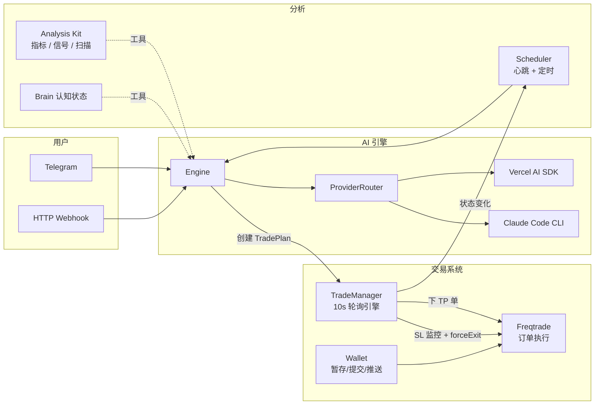

<p align="center">
  
</p>

<h1 align="center">TradeClaw</h1>

<p align="center">AI-native 加密货币交易系统 — AI 做策略决策，TradeManager 自动执行多级止盈止损，24/7 全自动管理交易生命周期。</p>

---

- **Scanner 是眼睛** — 计算 SL/TP（ATR + 结构），提供 regime 自适应的数字基础。
- **AI 是大脑** — 分析市场、GO/NO-GO 决策、制定交易计划。判断而非计算。
- **TradeManager 是双手** — 10 秒轮询自动执行：逐级止盈、价格监控止损、渐进保护、Chandelier 追踪。
- **Freqtrade 是基础设施** — 订单路由、K 线数据、白名单管理。不做任何自主决策。

## 核心架构

```
Scanner (计算 SL/TP) → AI (决策大脑) → TradePlan (TP/SL 计划) → TradeManager (自动执行) → Freqtrade (交易所)
```



## TradeManager — 交易计划自动执行

每笔交易由 AI 创建一个 **TradePlan**，TradeManager 负责自动执行：

```
TradePlan 生命周期: pending → active → partial → completed
```

| 功能 | 说明 |
|------|------|
| **多级止盈** | 1-5 个 TP 级别，按比例逐级平仓（Freqtrade 限制每笔交易只能有一个挂单，TradeManager 自动逐级下单） |
| **止损监控** | TradeManager 每 10s 检查价格，突破 SL 时通过 Freqtrade forceExit 平仓（不再依赖 CCXT 止损单） |
| **SL/TP 验证** | 入场时强制校验：SL 方向、距离 0.3%-15%、TP 方向、R:R ≥ 1.0，不合理的计划直接拒绝 |
| **渐进保护** | ATR 阶梯式 SL 收紧：+1.0x → -0.5x ATR，+1.5x → 保本，+2.5x → 锁 +1x，+3.5x → 锁 +2x |
| **自动保本** | TP1 成交后自动将 SL 移到入场价（默认开启，可关闭） |
| **Chandelier 追踪止损** | SL 锚定周期高/低点 - ATR 倍数，优于简单固定/百分比追踪（推荐 2.5x ATR） |
| **Regime 自适应 TP** | Scanner 根据市场状态动态调整 TP 比例：趋势 30/30/40、震荡 50/30/20、默认 40/30/30 |
| **动态 SL 倍数** | ATR 倍数根据波动率分档 + 市场状态调整（趋势 ×1.2 放宽，震荡 ×0.85 收紧） |
| **实时 P&L** | 每 10s 计算：浮动盈亏、已实现盈亏、风险回报比、最大回撤 |
| **动态调整** | AI 可随时通过 `cryptoUpdateTradePlan` 修改 TP/SL/trailing 参数 |
| **时间衰减** | 交易超时未触 TP1 时自动收紧 SL（默认 8 小时后收紧 50% 距离） |
| **事件通知** | TP 成交、SL 触发、计划完成等状态变化自动注入 AI 下次心跳 |
| **持久化** | 活跃计划保存到 JSON，重启后自动恢复 |

**心跳中的展示效果：**

```
📋 Active Trade Plans:
- BTC/USDT LONG: entry $65000 | TP1 $67000 (50%, placed) | TP2 $70000 (50%, pending) | SL $63500 (placed) | 📈 uPnL: +$120.50 (+1.8%) | R:R 2.1 | maxDD: -0.5% [auto-BE, trail 1.5%] | active
```

## AI 交易工具

### 交易计划管理

| 工具 | 说明 |
|------|------|
| `cryptoCreateTradePlan` | 创建交易计划 — 多级 TP、SL、自动保本、trailing stop |
| `cryptoGetTradePlans` | 查询活跃计划 — 含实时 P&L、R:R、最大回撤 |
| `cryptoUpdateTradePlan` | 动态调整 — 修改 TP 目标/比例、SL 价格、trailing 参数 |
| `cryptoCancelTradePlan` | 取消计划 — 自动撤销所有挂单 |

### 订单执行

| 工具 | 说明 |
|------|------|
| `cryptoPlaceOrder` | 下单（AI 入场决策 → Freqtrade forceentry） |
| `cryptoClosePosition` | 紧急平仓（绕过 TradePlan，TradeManager 通过 forceExit 执行） |
| `cryptoGetPositions` | 实时持仓查询 |
| `cryptoGetAccount` | 账户余额查询 |
| `cryptoGetOrders` | 订单历史查询 |

### 组合管理

| 工具 | 说明 |
|------|------|
| `cryptoManageBlacklist` | 黑名单管理 |
| `cryptoLockPair` | 临时锁定币对 |
| `cryptoGetStrategyStats` | 入场标签/退出原因胜率统计 |
| `cryptoReloadConfig` | 重载配置 |
| `cryptoGetWhitelist` | 白名单查询 |

### 决策辅助

| 工具 | 说明 |
|------|------|
| `thinkBeforeTrade` | 交易前强制思考 — 记录理由、风险、情绪状态 |
| `tradeMemoryQuery` | 查询交易记忆 — 过往同类信号的教训 |
| `tradeMemoryUpdate` | 更新交易记忆 — 记录复盘教训 |

### 分析 & 信号

| 工具 | 说明 |
|------|------|
| `strategyScan` | 全白名单策略扫描（RSI 背离、EMA 趋势、突破、资金费率反转） |
| `proposeTradeWithButtons` | Telegram 交易提案（用户按钮确认） |
| `calculatePositionSize` | 仓位计算（2% 权益风险 + 4 项风控检查） |
| `syncSignalOutcomes` | 从已关闭交易同步信号结果 |

## AI 交易工作流

每 15 分钟心跳触发：

```
1. 扫描机会
   strategyScan → 过滤 confidence >= 70 + 市场状态对齐
   → calculatePositionSize → proposeTradeWithButtons → 用户确认
   → cryptoPlaceOrder → commit → push → cryptoCreateTradePlan

2. 管理持仓（基于心跳注入的实时数据）
   - 查看 P&L、R:R、最大回撤
   - 市场结构变化？→ cryptoUpdateTradePlan 调整 TP/SL
   - 自动保本和 trailing stop 无需干预

3. 日常维护
   - syncSignalOutcomes — 更新策略胜率
   - 每日 UTC 00:00 自动生成 P&L 日报
```

### Guard Pipeline — 多层风控守卫

代码级安全检查，不可被 AI 提示词绕过。每个交易操作必须通过全部守卫：

| 守卫 | 说明 |
|------|------|
| **MaxPositionSizeGuard** | 单仓位不超过 40% 权益 |
| **CooldownGuard** | 同币对 60 秒冷却 |
| **MaxOpenTradesGuard** | 最大并发仓位数（默认 5） |
| **MinBalanceGuard** | 可用余额 < 30% 权益禁止开仓 |
| **EmotionGuard** | 根据 AI 情绪状态调整仓位（cautious: 50%, scared: 25%, angry/tilted: 阻止） |
| **AccountDrawdownGuard** | 每日权益回撤 > 5% 时阻止新开仓（UTC 日重置） |

**安全设计：**
- 守卫异常 → fail-closed（阻止交易，不会因异常而放行）
- 配置驱动 (`data/config/guards.json`)，支持热重载
- SL/TP 入场验证：SL 方向正确、距离 0.3%-15%、TP 方向正确、R:R ≥ 1.0
- 渐进保护：利润达 ATR 阶梯时自动收紧 SL
- 时间衰减：超时未触 TP1 自动收紧 SL（下限 0.3%）
- Freqtrade 安全网 stoploss: -20%（TradeManager 失效时的最后防线）

## 策略扫描

心跳自动触发，六套策略 + 9 维评分 + 入场触发器：

| 策略 | 类型 | 触发条件 |
|------|------|----------|
| RSI 背离 + 成交量耗尽 | 均值回归 | 价格新低/高但 RSI 背离，成交量萎缩 |
| EMA 趋势动量 | 趋势跟随 | EMA9/21/55 三线顺序排列 + RSI 过滤 |
| N 周期突破 + 成交量 | 突破 | 突破 N 根 K 线高/低点 + 成交量 > 1.5x |
| 资金费率反转 | 逆向 | 极端资金费率 + RSI 加分 |
| BB 均值回归 | 均值回归 | 布林带极端偏离 + 反转确认 |
| 结构突破 | 结构 | BOS/CHoCH + FVG 确认 |

**9 维评分系统** (总分 110)：趋势(20) + 动量(20) + 加速度(10) + 结构(15) + K 线质量(10) + 成交量(15) + 波动率(10) + 资金费率(5) + 崩盘风险(5)

**入场触发器增强：**
- Bullish/Bearish 确认需蜡烛方向一致 + 前一根 K 线弱势
- 支撑反弹需 RSI < 35 或成交量 > 1.5x 均值
- Pending Zones 在心跳中展示待触发区域

**增强机制：** 多时间框架过滤、4H EMA 市场状态检测（regime）、regime 自适应 TP 比例与 SL 倍数、OHLCV 缓存、信号持久化。

## 心跳注入数据

每次心跳自动注入以下实时数据供 AI 决策：

| 数据 | 说明 |
|------|------|
| 账户 & 持仓 | 余额、持仓详情、资金费率 |
| 交易计划 | 所有活跃 TradePlan + 实时 P&L |
| 市场状态 | 每个币对的趋势分类（uptrend / downtrend / ranging） |
| 策略信号 | 六套策略扫描结果 + 9 维评分 |
| 待触发区域 | Pending Zones（等待回调入场的高评分信号） |
| 数据新鲜度 | 扫描时间戳 + 数据年龄 |
| Freqtrade 状态 | 健康检查、入场/退出统计、待处理订单 |
| 每日 P&L | 最近 7 天收益曲线 |
| 币对表现 | 按利润排序的币对表现（top 5 + worst 3） |

## Freqtrade 策略：TradeClaw.py

薄策略 — 不产生任何交易信号，AI 通过 forceentry/forceexit 控制所有进出场。

提供的技术指标：

| 类别 | 指标 |
|------|------|
| 趋势 | EMA9/21/55、SMA200 |
| 动量 | RSI14、MACD（线 + 信号 + 柱状图） |
| 波动率 | ATR14、布林带（上/中/下轨 + 带宽） |
| 成交量 | Volume SMA20 |

安全网 stoploss = -20%（仅在 TradeManager 完全失效时触发）。TradeManager 通过价格监控 + forceExit 管理 SL，不再依赖 CCXT 止损单。

## 快速开始

### 前置条件

- Node.js 20+
- pnpm 10+
- Freqtrade 实例（推荐）— 所有仓位管理通过 Freqtrade API

### 安装

```bash
git clone https://github.com/imsatoshi/TradeClaw.git
cd TradeClaw
pnpm install
cp .env.example .env    # 填入 API 密钥
```

### 配置交易后端

**Freqtrade（推荐）** — 通过 REST API 连接：

```bash
cp data/config/crypto.freqtrade.example.json data/config/crypto.json
```

**CCXT 直连** — 连接任何 CCXT 支持的交易所：

```bash
cp data/config/crypto.binance.example.json data/config/crypto.json
```

### AI 服务商

`data/config/model.json` 配置：

```json
{ "provider": "anthropic", "model": "claude-sonnet-4-20250514" }
```

也支持 OpenAI 兼容服务：

```json
{ "provider": "openai", "model": "deepseek-chat", "baseUrl": "https://api.deepseek.com/v1" }
```

支持运行时通过 Telegram `/settings` 切换 Vercel AI SDK 和 Claude Code CLI。

### 运行

```bash
pnpm dev        # 开发模式
pnpm build      # 生产构建
```

### 部署 Freqtrade 策略

将策略文件复制到 Freqtrade 的策略目录：

```bash
cp freqtrade/strategies/TradeClaw.py /path/to/freqtrade/user_data/strategies/
```

### 环境变量

| 变量 | 说明 |
|------|------|
| `ANTHROPIC_API_KEY` | Anthropic API 密钥 |
| `OPENAI_API_KEY` | OpenAI 兼容 API 密钥 |
| `OPENAI_BASE_URL` | OpenAI 兼容服务端点 |
| `EXCHANGE_API_KEY` | 交易所 API 密钥（CCXT 模式） |
| `EXCHANGE_API_SECRET` | 交易所 API Secret |
| `TELEGRAM_BOT_TOKEN` | Telegram 机器人 Token |
| `TELEGRAM_CHAT_ID` | 允许的聊天 ID（逗号分隔） |

## 安全与韧性

| 机制 | 说明 |
|------|------|
| **Guard Pipeline** | 6 层风控守卫，异常时 fail-closed（阻止交易） |
| **熔断器** | TradeManager 连续 10 次 tick 失败 → 发出临界告警 |
| **计划对账** | 每 5 分钟 + 启动时检测外部关闭的交易，自动归档孤立计划 |
| **TP 重试** | TP 下单失败自动重试 3 次，耗尽后告警 |
| **原子持久化** | TradePlan 文件写入使用 tmp + rename，防止崩溃丢失数据 |
| **Session 自动裁剪** | 启动时裁剪历史（Telegram: 300, Web: 200 条），防止内存溢出 |
| **Compaction 指数退避** | LLM 压缩失败后 5m → 15m → 1h → 4h 退避 |
| **错误节流** | 重复错误日志 5 分钟内只记录一次，每小时清理过期条目 |
| **DCA 安全** | 硬止损前验证交易是否仍存在，避免对已关闭交易调用 forceExit |

## 其他功能

- **双 AI 引擎** — Vercel AI SDK（进程内）+ Claude Code CLI（子进程），运行时切换
- **认知状态** — 持久化大脑：前额叶记忆、情绪追踪、提交历史
- **A 股行情** — 东方财富免费 API，搜索/行情/K 线/指标分析
- **浏览器自动化** — Playwright/CDP 浏览器引擎
- **调度系统** — 心跳循环 + 定时任务 + 消息投递队列
- **连接器** — Telegram 机器人、HTTP Webhook、MCP Server
- **Portfolio 看板** — `/portfolio` HTML 看板 + `/api/portfolio` JSON API

## 配置

所有配置位于 `data/config/`，JSON 格式 + Zod 校验。

| 文件 | 用途 |
|------|------|
| `engine.json` | 交易对、轮询间隔、HTTP/MCP 端口 |
| `model.json` | AI 模型、服务商 |
| `crypto.json` | 交易后端（Freqtrade 或 CCXT） |
| `strategy-params.json` | 策略扫描参数（阈值、MTF 权重） |
| `scheduler.json` | 心跳间隔、定时任务 |
| `guards.json` | 风控守卫配置（启用/禁用、参数） |
| `auto-trade.json` | 自动执行配置（信心阈值、评级、仓位上限） |
| `tools.json` | 工具禁用列表 |
| `retention.json` | 数据保留策略（事件/信号/交易/新闻） |
| `persona.md` | 系统人格提示词 |

## 项目结构

```
src/
  main.ts                        # 组合根
  core/                          # Engine、Scheduler、Cron、Delivery、ProviderRouter
  providers/
    vercel-ai-sdk/               # Vercel AI SDK 封装
    claude-code/                 # Claude Code CLI 封装
  extension/
    analysis-kit/                # 行情、指标、策略扫描
    crypto-trading/
      trade-manager/             # TradeManager — 交易计划自动执行引擎
        TradeManager.ts          # 核心轮询引擎（10s tick，价格监控 SL，渐进保护，熔断器，对账）
        TradeManager.spec.ts     # 单元测试（50+ 用例）
        types.ts                 # TradePlan、P&L、TrailingStop、DCA 类型
        store.ts                 # 内存 + JSON 持久化（原子写入）
        adapter.ts               # AI 工具（4 个）
      guards/                    # Guard Pipeline — 风控守卫
        guard-pipeline.ts        # 流水线执行器（fail-closed）
        account-drawdown-guard.ts # 每日回撤守卫
        emotion-guard.ts         # 情绪守卫
        registry.ts              # 配置驱动守卫注册
      providers/
        freqtrade/               # Freqtrade REST API
    brain/                       # 认知状态
    ashare/                      # A 股行情
    browser/                     # 浏览器自动化
    cron/                        # 定时任务
  connectors/
    telegram/                    # Telegram 机器人
  plugins/
    http.ts                      # HTTP Webhook
    mcp.ts                       # MCP Server
data/
  config/                        # JSON 配置
  trade-plans/                   # 交易计划持久化（active.json + history.json）
  sessions/                      # JSONL 对话历史
  brain/                         # 认知状态
  signals/                       # 信号历史
freqtrade/
  strategies/
    TradeClaw.py                 # Freqtrade 策略（无信号，AI 完全控制）
HEARTBEAT.md                     # 自主心跳监控指令
```

## 致谢

TradeClaw 的架构设计受益于 [OpenAlice](https://github.com/TraderAlice/OpenAlice) 和 [OpenClaw](https://github.com/anthropics/claude-code) 两个项目：

- **OpenAlice** — AI Agent 框架的基础架构：引擎、调度系统、会话管理、多连接器设计均源自 OpenAlice 的开创性工作。
- **OpenClaw** — 心跳/Cron/投递队列的调度架构、浏览器自动化子系统、Agent 工具沙箱等核心模块的设计灵感来自 OpenClaw。

感谢这两个项目为 AI-native 应用架构探索出的道路。

## 许可证

[MIT](LICENSE)
