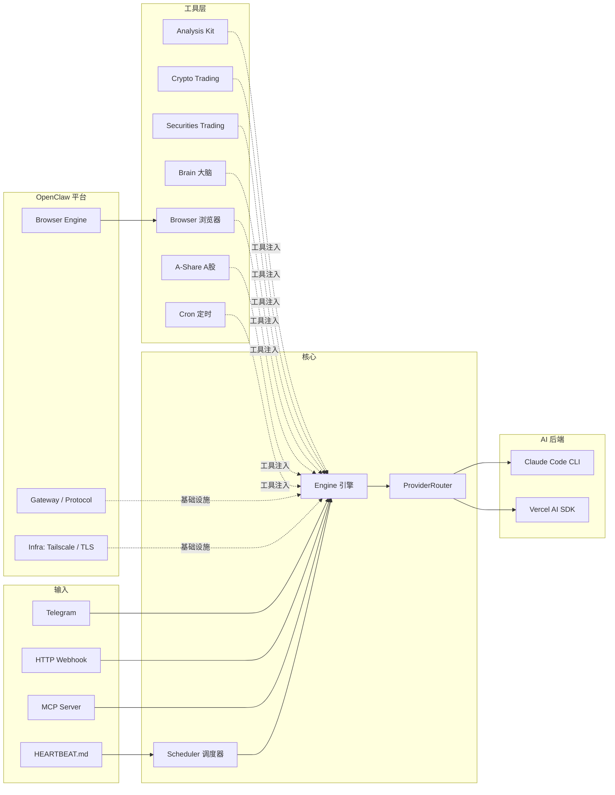

<p align="center">
  
</p>

<h1 align="center">TradeClaw</h1>

<p align="center">AI 投资组合经理 — 管理算法策略的交易范围、监控风险、分析信号表现，24/7 守护你的投资组合。</p>

---

- **文件驱动** — Markdown 定义人格，JSON 定义配置，JSONL 存储对话，HEARTBEAT.md 定义自主监控行为。没有数据库，只有文件。
- **推理驱动** — 每个交易决策都来自实时工具调用+信号混合，不依赖缓存状态。幻觉检测和工具放弃检测防止模型声称行动却未实际执行。
- **平台原生** — 构建于 OpenClaw 基础平台之上：完整的 Playwright/CDP 浏览器自动化、Tailscale 组网、设备认证、TLS 管理。

## 功能

- **双 AI 引擎** — 运行时通过 Telegram `/settings` 切换 Claude Code CLI 和 Vercel AI SDK（支持任意 OpenAI 兼容服务商）
- **加密货币交易** — CCXT（直连交易所）或 [Freqtrade](https://www.freqtrade.io/) 策略机器人，AI 作为基金经理管理策略范围
- **证券交易** — Alpaca 美股集成，暂存→提交→推送三段式操作流
- **策略自动扫描** — 一次调用扫描全仓位品种，内置 RSI 背离、布林带挤压、资金费率反转三套 4H 策略，心跳自动触发
- **市场分析** — 技术指标（RSI、MACD、布林带、ATR 等）、新闻搜索、Binance 公开 API 行情
- **A 股行情** — 东方财富免费 API，搜索、实时行情、K 线、技术指标（只分析，不交易）
- **认知状态** — 持久化"大脑"：前额叶记忆、情绪追踪、提交历史
- **浏览器自动化** — 完整 OpenClaw 浏览器引擎：16 种操作、Chrome 配置文件、CDP 直连、沙盒 Docker 模式
- **调度系统** — 心跳循环 + 定时任务，Transcript 修剪防止无效心跳污染会话，投递队列保证消息不丢失
- **连接器** — Telegram 机器人、HTTP Webhook、MCP Server

## 架构



**输入** — Telegram/HTTP/MCP 接收用户消息转发给 Engine；Scheduler 定时读取 HEARTBEAT.md 触发自主心跳。

**核心** — `Engine` 管理 AI 对话，内置幻觉检测（模型声称交易但未调工具）和工具放弃检测（工具失败后模型拒绝重试）。`ProviderRouter` 在 Vercel AI SDK 和 Claude Code 之间切换，两者共享同一套工具和会话。会话以 JSONL 持久化，自动压缩。

**工具层** — 按领域划分的扩展集，组合注入到 Engine。每个扩展独立管理工具、状态和持久化。

**OpenClaw 平台** — 底层基础设施：完整的 Playwright/CDP 浏览器引擎（含 Chrome 配置文件、Extension Relay、代理）；Gateway 协议层（TypeBox schema、设备认证）；Infra 层（Tailscale 组网、TLS 证书管理、端口检测）。

## 快速开始

### 前置条件

- Node.js 20+
- pnpm 10+

### 安装

```bash
git clone https://github.com/imsatoshi/TradeClaw.git
cd TradeClaw
pnpm install
cp .env.example .env    # 然后填入你的 API 密钥
```

### AI 服务商

提供两种模式：

- **Vercel AI SDK**（默认）— 在进程内运行代理。在 `data/config/model.json` 中配置：

  ```json
  { "provider": "anthropic", "model": "claude-sonnet-4-20250514" }
  ```

  也支持 OpenAI 兼容服务（DeepSeek、Kimi 等）：

  ```json
  { "provider": "openai", "model": "deepseek-chat", "baseUrl": "https://api.deepseek.com/v1" }
  ```

  > DeepSeek 等模型会触发额外的幻觉检测和工具放弃检测（Claude 足够可靠，不需要这些防护）。

- **Claude Code** — 以子进程方式启动 `claude -p`，赋予代理完整的 Claude Code 能力。需要在宿主机上安装并认证 [Claude Code](https://docs.anthropic.com/en/docs/claude-code)。

### 加密货币交易

支持两种执行后端：

**CCXT（直连交易所）** — 连接任何 [CCXT 支持的交易所](https://docs.ccxt.com/)：

```bash
cp data/config/crypto.binance.example.json data/config/crypto.json
```

**Freqtrade（策略机器人）** — 通过 REST API 连接 [Freqtrade](https://www.freqtrade.io/) 实例。AI 作为**基金经理**管理策略：

```bash
cp data/config/crypto.freqtrade.example.json data/config/crypto.json
```

Freqtrade 模式下，AI 不直接下单，而是管理宏观层面：

| 工具 | 说明 |
|------|------|
| `cryptoManageBlacklist` | 黑名单管理 — 控制策略可以交易哪些币对 |
| `cryptoLockPair` | 临时锁定 — 短期暂停某个币对的交易 |
| `cryptoGetStrategyStats` | 策略分析 — 按入场信号/退出原因查看胜率和收益 |
| `cryptoReloadConfig` | 重载配置 — 黑名单/白名单修改后刷新策略 |
| `cryptoGetPositions` | 持仓监控 — 显示 NFI 信号标签、DCA 次数、利润率 |
| `cryptoClosePosition` | 紧急平仓 — 仅用于黑天鹅等系统性风险 |
| `cryptoGetWhitelist` | 白名单查询 — 查看策略当前交易的币对列表 |

Freqtrade HTTP 请求内置自动重试（最多 2 次，间隔 1s），瞬态网络错误在引擎层消化，不暴露给 AI 模型。

### 策略自动扫描

每次心跳，AI 调用 `strategyScan` 一次性扫描所有白名单品种，内置三套 4H 策略：

| 策略 | 类型 | 触发条件 |
|------|------|----------|
| RSI 背离 + 成交量耗尽 | 均值回归 | 价格新低/高但 RSI 背离，成交量萎缩确认 |
| 布林带挤压 + MACD 交叉 | 突破 | 带宽低于均值（挤压态），histogram 穿零 + 成交量放大 |
| 资金费率反转 | 逆向 | 极端资金费率（>0.10% 或 <-0.05%）+ RSI 超买/超卖 |

信号检测由确定性代码完成，AI 负责结合持仓/时段/账户状态做最终决策。系统内置 UTC 交易时段感知（亚洲/伦敦/纽伦重叠/纽约/深夜），深夜时段只执行置信度 ≥ 80 的强信号。

### 证券交易

基于 [Alpaca](https://alpaca.markets/)。支持模拟盘和实盘 — 在 `data/config/securities.json` 中切换。

### A 股行情分析

内置东方财富免费 API，**无需配置**，开箱即用。只做分析，不做交易。

| 工具 | 说明 |
|------|------|
| `searchAShare` | 搜索股票（代码或中文名） |
| `getAShareQuote` | 批量实时行情 |
| `getAShareKline` | K 线数据（日/周/月/分钟线） |
| `calculateAShareIndicator` | 技术指标计算，复用 Analysis Kit 引擎 |

### 环境变量

| 变量 | 说明 |
|------|------|
| `ANTHROPIC_API_KEY` | Anthropic API 密钥 |
| `OPENAI_API_KEY` | OpenAI 兼容 API 密钥（DeepSeek、Kimi 等） |
| `OPENAI_BASE_URL` | OpenAI 兼容服务的自定义端点 |
| `EXCHANGE_API_KEY` | 交易所 API 密钥（CCXT 模式） |
| `EXCHANGE_API_SECRET` | 交易所 API Secret（CCXT 模式） |
| `EXCHANGE_PASSWORD` | 交易所口令（OKX 等） |
| `TELEGRAM_BOT_TOKEN` | Telegram 机器人 Token |
| `TELEGRAM_CHAT_ID` | 允许的聊天 ID，逗号分隔 |
| `ALPACA_API_KEY` | Alpaca 美股 API 密钥 |
| `ALPACA_SECRET_KEY` | Alpaca 美股 Secret 密钥 |

### 运行

```bash
pnpm dev        # 开发模式（热重载）
pnpm build      # 生产构建
pnpm test       # 运行测试
```

## 配置

所有配置位于 `data/config/`，JSON 格式 + Zod 校验。缺少的文件使用默认值。

| 文件 | 用途 |
|------|------|
| `engine.json` | 交易对、轮询间隔、HTTP/MCP 端口、时间框架 |
| `model.json` | AI 模型服务商、模型名称、可选 base URL |
| `agent.json` | 最大代理步数、Claude Code 允许/禁止的工具 |
| `crypto.json` | 加密交易 — CCXT（交易所、交易对）或 Freqtrade（URL、凭证） |
| `securities.json` | 证券交易、Alpaca 账户、模拟盘开关 |
| `compaction.json` | 上下文窗口限制、自动压缩阈值 |
| `scheduler.json` | 心跳间隔、定时任务开关、消息投递队列 |
| `persona.md` | 系统提示词人格（自由格式 Markdown） |

## 项目结构

```
src/
  main.ts                    # 组合根 — 连接所有模块
  core/                      # Engine、Session、Scheduler、Cron、Delivery、ProviderRouter、Guards
  providers/
    claude-code/             # Claude Code CLI 子进程封装
    vercel-ai-sdk/           # Vercel AI SDK ToolLoopAgent 封装
  extension/
    analysis-kit/            # 行情数据、指标计算、新闻、沙盒、策略扫描
    ashare/                  # A 股行情分析（东方财富 API）
    crypto-trading/          # 交易引擎工厂 + 钱包
      providers/
        ccxt/                # 直连交易所（CCXT）
        freqtrade/           # Freqtrade REST API 集成
    securities-trading/      # Alpaca 集成、钱包、工具
    brain/                   # 认知状态（前额叶记忆、情绪追踪）
    browser/                 # OpenClaw 浏览器桥接（Vercel AI SDK 格式适配）
    cron/                    # 定时任务管理工具
  connectors/
    telegram/                # Telegram 机器人（轮询、命令、设置）
  plugins/
    http.ts                  # HTTP Webhook 端点
    mcp.ts                   # MCP Server 工具暴露
  openclaw/                  # 底层基础平台（来自 OpenClaw 项目）
    agents/                  # Agent 沙盒、工具策略、Glob 模式匹配
    browser/                 # 完整浏览器引擎：Playwright/CDP、Chrome 配置文件、Extension Relay
    channels/                # 插件/频道注册表
    gateway/                 # 认证、协议层、TypeBox schema 定义
    infra/                   # Tailscale 组网、设备认证、TLS、端口检测
    logging/                 # 结构化日志子系统
    media/                   # 图片处理（sharp）
    plugins/                 # 插件注册表和运行时
    sessions/                # 会话管理工具
    terminal/                # ANSI 终端 UI
data/
  config/                    # JSON 配置文件
  sessions/                  # JSONL 对话历史
  brain/                     # 前额叶记忆、情绪日志
  crypto-trading/            # 加密钱包提交历史
  securities-trading/        # 证券钱包提交历史
HEARTBEAT.md                 # 自主心跳监控指令（AI 每次心跳读取并执行）
```

## 许可证

[MIT](LICENSE)
